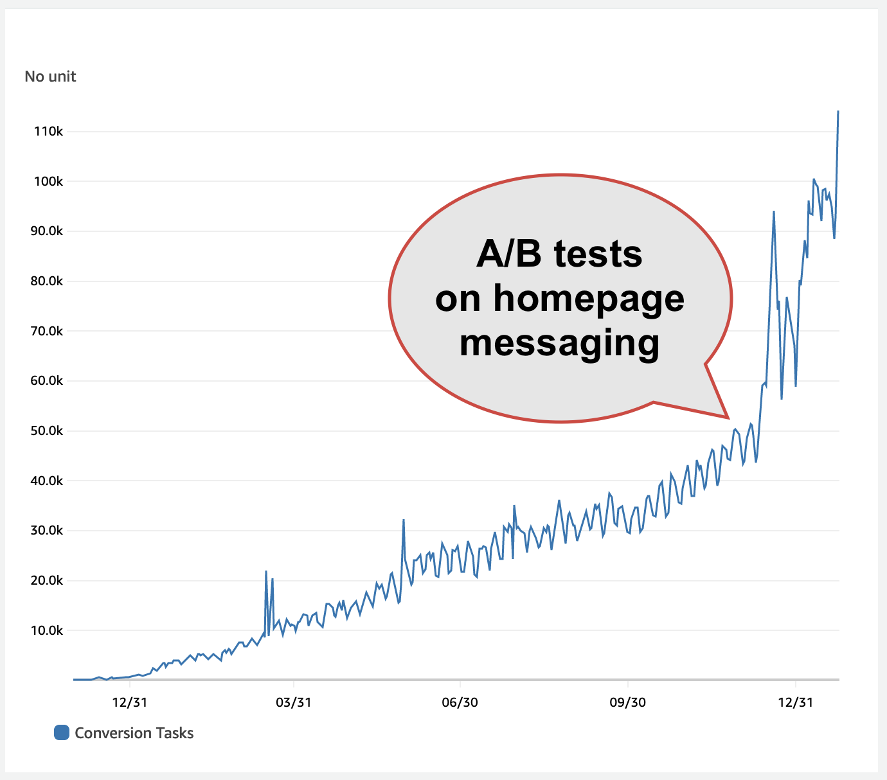

# Cheap and scalable A/B testing with Amazon CloudFront

_This is a guest post from [AWS Serverless Hero Gojko Adzic](https://aws.amazon.com/developer/community/heroes/gojko-adzic/)._

At [Narakeet](https://www.narakeet.com), we help people build video and audio files easily using realistic text to speech. During the past year, our web site traffic grew by roughly 100 times. A single change in HTML improved our homepage conversion rates by 18%, and almost doubled our recent growth. Implementing the change was trivial. Finding what to change was a lot more difficult, particularly confirming that it was the right thing, and that it had no negative side-effects. Of course, the answer was to run an A/B test (actually a bunch of tests).

At the most basic level, an A/B test is a way to prove (or disprove) a hypothesis with a fork in the road for users. Some users see one variant of a button, a message or a whole page, and some users see another. After that, the system tracks user activity and collects information on whether the groups behaved differently.

A/B testing was the secret superpower of some tech companies in the early 2000s. After the Obama campaign use it to tweak email messaging in the 2007 US presidential elections, the technique entered everyday jargon, and spun a whole new industry of expensive tools and services to help with online experiments. Tools that can help you run a high-risk test at scale with confidence can easily cost five figures in dollars to even get started. Or you can do what we did, and run everything inside [Amazon CloudFront](https://aws.amazon.com/cloudfront/) and [Amazon CloudWatch](https://aws.amazon.com/cloudwatch/), almost for free. Here's how.

## Making high-risk changes at scale

Active usage increased from 150-200 conversion tasks per day to roughly 100,000 daily conversions, about 500-600x year-on-year growth. Luckily, we built everything to auto scale on AWS, so the technical side of growing was smooth. As the user base expanded, the messaging on our homepage no longer suited the larger audience. Search engines kept sending us more and more people, but the old homepage didn't capture their interest. We could see a change in user preferences, with different types of workflows and content becoming popular. We wanted to tweak the homepage messaging to match the new needs. However, there was also a big risk of any change causing negative side-effects which we could not even predict.

A little secret of modern software product management is that nobody really knows what is going to happen with a proposed change. What product managers think their users will do, and what real people actually end up doing, don't necessarily match. In fact, the seminal research paper [Online Experimentation at Microsoft](https://www.microsoft.com/en-us/research/publication/online-experimentation-at-microsoft/) suggests that "only about 1/3 of ideas improve the metrics they were designed to improve," and an equal number actually create a negative impact. At Google, choosing one [blue shade over another](https://www.theguardian.com/technology/2014/feb/05/why-google-engineers-designers) famously prevented a 200 million dollar mistake, with the final choice contradicting the request of design experts. After three years of work, we had finally found a growth path that produced results. With the right messaging, we thought that it could perform even better. But a bad decision about that could easily throw a spanner in the works. To make a decision like that, the most powerful tool in our arsenal today is an A/B test.



> _Usage growth at Narakeet during 2022, with the key time point after we changed messaging on the homepage as a result of the A/B test_

## Running A/B tests with Amazon CloudFront

An A/B test reduces business risk by temporarily increasing technical complexity, which means it can also introduce technical risks. There are a few important risks that need to be managed with such tests, especially related to Web pages:

- Dynamically changing content after a page loads can impact [Core Web Vitals](https://support.google.com/webmasters/answer/9205520?hl=en) (especially layout shifts), which in late 2022 became one of the critical factors for search engine ranking.
- Additional page content can impact page loading performance, which can also impact search ranking and user behaviour in general.
- Collecting sensitive interactions or information may have an impact on privacy/data sharing (for example, with [GDPR](https://aws.amazon.com/compliance/gdpr-center/)).
- Tracking interactions and user goals can also impact system or page performance, and if it introduces a significant delay, it can change how users behave during the test.
- Third-party content (cookies and scripts) can get blocked by browsers and browser extensions, making the test unreliable in case a large percentage of the audience blocks such content.

With web tests in particular, A/B testing usually works by embedding a bit of JavaScript from a testing provider. This makes tests easy to run, but it can get quite expensive at scale. It may also not be entirely accurate when people turn off JavaScript, or if ad blockers or content blockers start flagging additional scripts.

If your app is served using CloudFront, you can actually achieve everything just by tweaking routing. There is no need to pay for expensive third party services, add external scripts, and increase risk to user privacy. Even better, you can create a solution that doesn't depend on JavaScript at all. Provide two different static pages, and let users load one or another. Finally, if the test goal can be captured by a user visiting a web page (for example the registration or the purchase page), then CloudFront logs can be used to track the test performance, without any change to your application code. This means that there's no risk to changing user behaviour by introducing additional measurements in the app code.

The key to unlock all these benefits are [CloudFront Functions](https://docs.aws.amazon.com/AmazonCloudFront/latest/DeveloperGuide/cloudfront-functions.html). CloudFront Functions are triggered by events at the edge of content delivery and can be used to do minor tweaks to HTTP requests and responses, including adding headers and cookies or changing request properties. There are two event types that are interesting for our case:

- A "viewer request" event runs a function after CloudFront receives a request from a user, but before it tries to locate the content to serve back.
- A "viewer response" event runs a function after CloudFront retrieves the content to serve, but before it sends the content back to the user.

We can use a function triggered by "viewer request" events to redirect some requests to an alternative page. For example, we could prepare two variants of the homepage, `index.html` and `index2.html`, and assign 50% of the traffic requesting the homepage URL to each of them.

We can then use a function triggered by "viewer response" events to mark a user with a cookie, saving the test cohort assignment for later. This cookie will then be sent back to CloudFront for any subsequent requests, so that we can use it to track users later when they reach a goal. We can also use this cookie to reliably show the same person the same content variant. For example, if the routing function spots a cookie with the cohort assignment, it knows that the user is already participating in the test, and could show them the same homepage version as before.

In order to be able to run several tests in parallel, we'll use a single cookie, but populate it with comma-separated tags based on the test name. For example, if the test started on 11 December and it's about improving registrations, we could call it `dec11reg`. We will use `dec11reg-v` to signal that the user is assigned to a variant (they will see the changed page), or `dec11reg-c` to signal that the user is part of the control cohort (they see an unchanged page).

Deploy a test app for this article from **TODO Github repository**, and you'll be able to see this in action.


> _A user gets assigned to a variant, with CloudFront adding a cookie to mark the user._

We can use either a "viewer request" or a "viewer response" event to track when a user reached the target page (for example, a purchase or registration page). In theory, there isn't much difference which one we choose, unless we want to also mark the user somehow. For optimizing our homepage messaging, we track if a user runs an audio or video conversion task after visiting the homepage, effectively checking if a user started getting benefits from our product. We wanted to avoid double-counting a user that makes many audio or video files. Once a user achieves the goal for the first time, we no longer want to count them as part of the test, but we still want to show them the same homepage variant as before. For that purpose, we'll mark users with an additional goal cookie. In order to be able to mark users with cookies, it's better to use a "viewer response" function to track goals. We can mark that a user achieved a goal and avoid double-counting by using a tag called `dec11reg-g`.


> _A user gets marked with as reached the goal, so we don't double-count them._

### Two technical challenges

There are two key technical challenges to make this approach to testing work.

The first challenge is that a "viewer request" function needs to perform cohort assignment, so it can modify the routing before CloudFront loads a page. However, "viewer request" functions can't modify response headers directly, so they cannot mark users with cookies. However, they can add a header to the request, and a "viewer response" function attached to the same user request will have access to that header. We can use custom header to transfer information about cohort assignment between two CloudFront functions, and then let the "viewer response" function mark the user with a cookie.

The second challenge is to get the cohort assignment and goal achievement information out of CloudFront. For that, we can just use CloudWatch, as any logging to console from CloudFront functions automatically gets sent to CloudWatch logs. As long as we log something that is structured so it can be reliably filtered and analyzed, it will be easy to extract that information later using [CloudWatch Log Insights](https://docs.aws.amazon.com/AmazonCloudWatch/latest/logs/AnalyzingLogData.html). For example, we will log a JSON object for each A/B test with three fields:

- `experiment`: the name of the test
- `cohort`: the name of the group where the user is assigned
- `action`: assignment or achieving a goal

This makes it easy to find matching log entries, and count them using a CloudWatch insight query. Select the logs for all the CloudFront functions created for the A/B test, and run the following query on them:

```sql
parse @message '{"experiment":"*","cohort":"*","action":"*"' as experiment, cohort, action
| filter experiment='dec11reg'
| stats count() by cohort, action
| sort cohort, action
```

CloudWatch will promptly show a table listing how many people were assigned to each cohort, and how many of those achieved the goal.


> _CloudWatch insights shows the test results_

For readers familiar with CloudWatch insights, who are now wondering why we are not using just the regular syntax to inspect JSON objects, note that CloudFront Functions always insert some request data at the start of the log. Even if you are just logging JSON, because of that extra information CloudWatch can't directly break down the @message field into JSON components. For simple structured logs, the `parse @message` syntax does the trick, but the JSON fields will always need to be in the same order for this to work.

### Code examples

Here is a CloudFront template that puts all this into code (Check out **TODO Github repository**) for a simple to use example.

First, we'll use CloudFront parameters to configure the test, setting the cookie names for cohort assignment, and the URLs we want to use for testing purposes:

```yaml
AWSTemplateFormatVersion: '2010-09-09'
Description: Example A/B Test Web CDN stack
Parameters:
  TagCookieName:
    Description: The name of a cookie that will be used
    Type: String
    Default: tag
  TagCookieAgeInDays:
    Description: the duration of a tag cookie for cohort allocation
    Type: Number
    Default: 20
  ABTestExperimentName:
    Description: >
      The name of an A/B test to deploy.
      Provide a short alphanumerical string to enable A/B testing, or leave blank to disable A/B testing.
      This value will be used as a prefix for the cohort allocation, so multiple tests can run in parallel.
      If you enable A/B testing, make sure to check/override ABTestUrl, ABTestVariantUrl, ABTestGoalUrl)
    Type: String
    Default: ""
  ABTestUrl:
    Type: String
    Default: "/index.html"
    Description: >
      The web page relative URL (path in the CloudFront origin) that will be used for A/B testing.
      Start with "/", for example "/index.html".
      The control cohort will see the page matching the URL from the origin.
      The variant cohort will see an alternative page when requesting this URL (see ABTestVariantUrl).
  ABTestVariantUrl:
    Type: String
    Default: "/index2.html"
    Description: >
      The path in the CloudFront origin that will be shown to the variant cohort when requesting the ABTestUrl.
      Start with "/", for example "/index2.html".
  ABTestGoalUrl:
    Type: String
    Default: "/success.html"
    Description: >
      The path in the CloudFront origin that will be used to log successful conversions.
      (visiting this page signals that a user has fulfilled the goal of the A/B test, so page views on
      this URL will be used to measure the difference in effectiveness between cohort and variant. This
      could be the end of the conversion funnel, the payment success page, or some other signal that
      a user has achieved the required goal).
```

Next, we'll define a condition to help us deploy the CloudFront distribution with or without a test. That way, we can deploy the additional infrastructure only when we're running the test. If the `ABTestExperimentName` name is not provided as a parameter during deployment, we can just skip the extra code.

```yaml
Conditions:
  ShouldRunABTest: !Not [ !Equals ['', !Ref ABTestExperimentName]]
```

First, let's create the "viewer request" function. It will need to detect if the user is already assigned to a test cohort, and if not assign them randomly to the control or variant group. Any new assignments need to be logged to CloudWatch, so we can inspect them later. We also need to pass the cohort assignment to the second "viewer response" function in a header, so it can mark users with a cookie.

If the user is assigned to the variant cohort, the "viewer request" function needs to modify the `request.uri` property of the request, and set it to the alternative URL, so CloudFront can show the modified homepage.

Note that we're directly bundling the JavaScript code into CloudFormation to avoid an additional packaging step, and using the CloudFormation `!Sub` function to inject stack parameters into JavaScript code (`${TagCookieName}` is not JavaScript string interpolation, but CloudFormation replacing parameter values in a string).

So you can track what happens easily, we're also adding a `verboseLog` option. Turn that on, and the function will dump debugging information to the logs. This is a very useful trick when developing functions, as it makes debugging easier.

```yaml
AssignTestCohortFunction:
  Condition: ShouldRunABTest
  Type: AWS::CloudFront::Function
  Properties:
    AutoPublish: true
    FunctionConfig:
      Comment: 'Assign AB test cohort'
      Runtime: cloudfront-js-1.0
    Name: !Sub "${AWS::StackName}-assign-test-cohort"
    FunctionCode: !Sub |
      var tagCookieName = '${TagCookieName}';
      var verboseLog = ${VerboseLog};
      function handler(event) {
        if (verboseLog) {
          console.log('EVENT\n' + JSON.stringify(event));
        }
        var request = event.request;
        var cookieValue = (request.cookies[tagCookieName] && request.cookies[tagCookieName].value) || '';
        var tags = cookieValue.split(',').filter(t => t);
        if (verboseLog) {
          console.log('Existing tags: ' + JSON.stringify(tags));
        }
        var requestId = event.context.requestId;
        if (tags.includes('${ABTestExperimentName}-c')) {
          if (verboseLog) {
            console.log('already assigned to control');
          }
          return request;
        } else if (tags.includes('${ABTestExperimentName}-v')) {
          if (verboseLog) {
            console.log('already assigned to variant');
          }
          request.uri = '${ABTestVariantUrl}';
          return request;
        }
        var cohort = ((Math.random() < 0.5) ? 'v' : 'c');
        var headerName = 'x-cohort-${ABTestExperimentName}-assignment'.toLowerCase(); // CF complains if not
        request.headers[headerName] = {value: cohort};
        console.log(JSON.stringify({experiment: '${ABTestExperimentName}', cohort, action: "assignment", requestId}));
        if (cohort == 'v') {
            request.uri = '${ABTestVariantUrl}';
        }
        if (verboseLog) {
          console.log('REQUEST\n' + JSON.stringify(request));
        }
        return request;
      }

```

It's important to note that this function includes everyone in the test. Depending on your traffic patterns and test needs, you may want to explicitly exclude bots, search engines and web scrapers from the test, as that can skew results. You can use [AWS WAF Bot Control](https://aws.amazon.com/waf/features/bot-control/) to mark bots and then exclude them from the test results.

To restrict test participants geographically, or to a specific device, you can use the additional [CloudFront request headers](https://docs.aws.amazon.com/AmazonCloudFront/latest/DeveloperGuide/using-cloudfront-headers.html). For example, CloudFront automatically adds the `CloudFront-Viewer-Country-Name` header which we could use to run a test visitors from a specific country, or `CloudFront-Is-Desktop-Viewer` and `CloudFront-Is-Mobile-Viewer` headers to run tests only on mobile or desktop viewers.

The second function is going to act on a response for requests that have assigned a user to a test cohort. It needs to read the header containing cohort assignment, and merge it into the cookie for user tracking.

```yaml
AssignCohortCookieFunction:
  Condition: ShouldRunABTest
  Type: AWS::CloudFront::Function
  Properties:
    AutoPublish: true
    FunctionConfig:
      Comment: 'Assign cohort cookie'
      Runtime: cloudfront-js-1.0
    Name: !Sub "${AWS::StackName}-assign-cohort-cookie"
    FunctionCode: !Sub |
      var verboseLog = ${VerboseLog};
      var tagCookieName = '${TagCookieName}';
      var cookieAgeDays = ${TagCookieAgeInDays};
      function handler(event) {
        if (verboseLog) {
          console.log('EVENT\n' + JSON.stringify(event));
        }
        var request = event.request;
        var response = event.response;
        var requestId = event.context.requestId;
        var headerName = 'x-cohort-${ABTestExperimentName}-assignment'.toLowerCase();
        var actualHeader = Object.keys(request.headers).find(h => h.toLowerCase() === headerName); // CF capitalizes header names
        var assignment = (actualHeader && request.headers[actualHeader].value) || '';
        if (verboseLog) {
          console.log('processing assignment: ' + assignment);
        }
        if (assignment) {
          var tag = '${ABTestExperimentName}-' + assignment;
          var cookieValue = (request.cookies[tagCookieName] && request.cookies[tagCookieName].value) || '';
          var tags = cookieValue.split(',').filter(t => t);
          if (verboseLog) {
            console.log('Existing tags: ' + JSON.stringify(tags));
          }
          if (!tags.includes(tag)) {
            if (verboseLog) {
              console.log('adding tag ' + tag + ' to ' + requestId);
            }
            response.cookies[tagCookieName] = {
              'value': tags.concat([tag]).join(','),
              'attributes': 'Path=/; Secure; HttpOnly; SameSite=Strict; Max-Age=' + (cookieAgeDays * 60 * 60 * 24)
            };
          } else if (verboseLog) {
            console.log('already assigned to ' + tag);
          }
        }
        if (verboseLog) {
          console.log('RESPONSE\n' + JSON.stringify(response));
        }
        return response;
      }
```

Finally, the third function tracks users when they reach a goal, and logs the fact about that to CloudWatch. It also marks the user with a goal cookie tag to avoid double-counting.

```yaml
LogGoalFunction:
  Condition: ShouldRunABTest
  Type: AWS::CloudFront::Function
  Properties:
    AutoPublish: true
    FunctionConfig:
      Comment: 'Log A/B goals'
      Runtime: cloudfront-js-1.0
    Name: !Sub "${AWS::StackName}-log-goal"
    FunctionCode: !Sub |
      var tagCookieName = '${TagCookieName}';
      var cookieAgeDays = ${TagCookieAgeInDays};
      var verboseLog = ${VerboseLog};
      function handler(event) {
        if (verboseLog) {
          console.log('EVENT\n' + JSON.stringify(event));
        }
        var request = event.request;
        var response = event.response;
        var requestId = event.context.requestId;
        var cookieValue = (request.cookies[tagCookieName] && request.cookies[tagCookieName].value) || '';
        var tags = cookieValue.split(',').filter(t => t);
        if (verboseLog) {
          console.log('Existing tags:' + JSON.stringify(tags));
        }
        if (tags.includes('${ABTestExperimentName}-g')) {
          if (verboseLog) {
            console.log('already captured in results');
          }
          return response; // already captured this user
        } else if (tags.includes('${ABTestExperimentName}-c')) {
          console.log(JSON.stringify({experiment: '${ABTestExperimentName}', cohort: 'c', action: "goal", requestId}));
        } else if (tags.includes('${ABTestExperimentName}-v')) {
          console.log(JSON.stringify({experiment: '${ABTestExperimentName}', cohort: 'v', action: "goal", requestId}));
        } else {
          if (verboseLog) {
            console.log('not assigned to cohort');
            return response;
          }
        }
        // mark user so we do not capture them again
        response.cookies[tagCookieName] = {
          'value': tags.concat(['${ABTestExperimentName}-g']).join(','),
          'attributes': 'Path=/; Secure; HttpOnly; SameSite=Strict; Max-Age=' + (cookieAgeDays * 60 * 60 * 24)
        };
        if (verboseLog) {
          console.log('RESPONSE\n' + JSON.stringify(response));
        }
        return response;
      }
```

To tie everything together, we can use the `CacheBehaviors` property of `AWS::CloudFront::Distribution` to define two additional behaviors for CloudFront. The first will override what happens to users when they try to visit the test page, and assign the first two CloudFront functions we defined to those requests. The second will override what happens to users when they try to visit the goal page, and assign the third function to those requests. Note that these overrides need to happen before the other cache behavior definitions.

```yaml
   WebCFDistribution:
    Type: AWS::CloudFront::Distribution
    Properties:
      DistributionConfig:
        # ... other parameters
        CacheBehaviors:
          - !If
            - ShouldRunABTest
            - PathPattern: !Ref ABTestUrl
              TargetOriginId: StaticFilesOrigin
              AllowedMethods:
                - GET
                - HEAD
              CachedMethods:
                - GET
                - HEAD
              Compress: true
              MinTTL: 0
              DefaultTTL: 86400
              MaxTTL: 31536000
              FunctionAssociations:
                - EventType: viewer-response
                  FunctionARN: !GetAtt AssignCohortCookieFunction.FunctionMetadata.FunctionARN
                - EventType: viewer-request
                  FunctionARN: !GetAtt AssignTestCohortFunction.FunctionMetadata.FunctionARN
              ForwardedValues:
                QueryString: false
                Cookies:
                  Forward: none
              ViewerProtocolPolicy: redirect-to-https
            - !Ref AWS::NoValue
          - !If
            - ShouldRunABTest
            - PathPattern: !Ref ABTestGoalUrl
              TargetOriginId: StaticFilesOrigin
              AllowedMethods:
                - GET
                - HEAD
              CachedMethods:
                - GET
                - HEAD
              Compress: true
              MinTTL: 0
              DefaultTTL: 86400
              MaxTTL: 31536000
              FunctionAssociations:
                - EventType: viewer-response
                  FunctionARN: !GetAtt LogGoalFunction.FunctionMetadata.FunctionARN
              ForwardedValues:
                QueryString: false
                Cookies:
                  Forward: none
              ViewerProtocolPolicy: redirect-to-https
            - !Ref AWS::NoValue
        ## Other cache behaviors
        DefaultCacheBehavior:
        # cache behaviour properties for pages that are not involved in the test
```

## Benefits of using CloudFront to manage A/B tests

Because CloudFront handles all the cookies, everything is first-party, and the risk of cookies being blocked is minimal. There is no additional JavaScript, no third party code, no additional risk for GDPR problems or privacy concerns, and no visible performance impact on page loading or transfer. With two static page variants, there's no content shifting after page load, so no additional risk for search engine ranking or core web vitals.

Finally, because everything just happens within CloudFront Functions, the cost is marginal. The first 2,000,000 CloudFront Function invocations per month are included in the free tier, and then [the pricing is $0.10 per 1 million invocations](https://aws.amazon.com/cloudfront/pricing/). With CloudWatch, the first 5 GB of data each month is free, and then it's [$0.50 per GB](https://aws.amazon.com/cloudwatch/pricing/) to store data in logs, and $0.005 per GB of data scanned to analyze them. That's usually a lot more than it takes to run a reliable and statistically significant A/B test. For our use case, having tests with a few tens of thousands of participants was enough, and we're logging just a few dozen bytes per test participant. Check out the excellent [A/B test calculator](https://cxl.com/ab-test-calculator/) from CXL online to figure out the right duration and cohort count for your site.

## Limitations using CloudFront to manage A/B tests

The major limitation of using CloudFront to assign people to cohorts is that it requires cookies. An alternative option is to use IP addresses to select cohorts. This makes the test fully reliable even if people turn off first-party cookies, but it doesn't guarantee a good balance of cohort populations. You may end up with a lot more users in one group than in the other depending on how you transform the IP address digits into a cohort, and where your traffic comes from.

The major limitation of using page visits to track goals is that each goal requires a separate URL, so you need to have a target page for the action that you want to measure. This is not so great if you want to track complex goals, for example the total value of purchases, not just the fact that someone purchased. It's possible to modify this approach to transfer complex goal information in the query string URL, then capture it using CloudFront functions and persist in cookies.

Goal tracking just by counting page visits to a target URL is not perfectly unique. In case of two parallel requests from the same user session to the goal URL, they would probably both be logged as success before the user is marked out of the test. This could be reduced by logging a different session cookie, with a client ID, and extracting data from CloudWatch and saving to DynamoDB or some other source, which can prevent duplicates. This requires slightly more complex goal tracking infrastructure. At the very least, you'll need a Lambda function that acts as a [CloudWatch Subscription Filter](https://docs.aws.amazon.com/AmazonCloudWatch/latest/logs/SubscriptionFilters.html#LambdaFunctionExample) to stream data out of CloudWatch logs somewhere else.

Alternatively, you could use CloudFront logs directly instead of using a function to track goals. Activate logging for CloudFront requests (make sure to include cookies if you use them to track cohorts), then just process CloudFront logs asynchronously to collect test results. This is how you can configure a distribution for logging with CloudFormation:

```yaml
Resources:
  
  # ...

  LoggingBucket:
    Type: AWS::S3::Bucket
    DeletionPolicy: Retain
    UpdateReplacePolicy: Retain
    Properties:
      LifecycleConfiguration:
        Rules:
          - ExpirationInDays: 180
            Status: Enabled

  WebCFDistribution:
    Type: AWS::CloudFront::Distribution
    Properties:
      Logging:
        Bucket: !GetAtt LoggingBucket.DomainName
        IncludeCookies: true
      # ...
```

---

## Questions to check with AWS

- can a origin-request function modify the response (eg set the cookie there? then we don't need the third function)
- is there some other header or CW synthetic request property that could be used to identify a client reliably (what's CloudFront-Viewer-JA3-Fingerprint )
- do we need to collect logs from multiple regions or just one region?
- does this need to be deployed in US-East-1 (Cloudfront?)
- should we suggest more complex goal tracking using CW Evidently or something like that?
